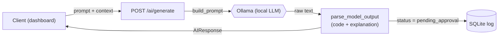
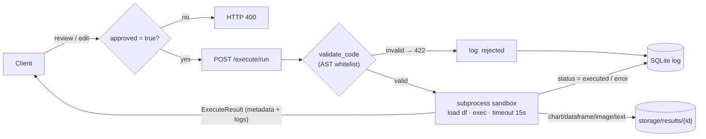
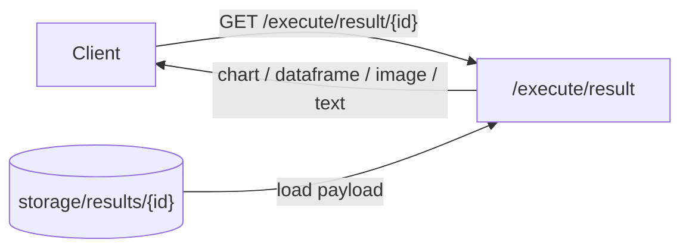
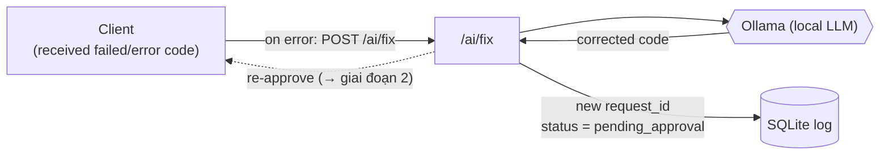
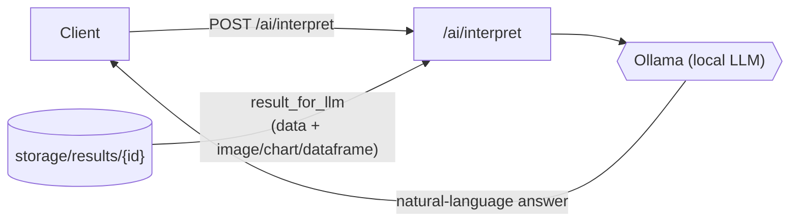

```bash
ollama serve > ollama.log 2>&1 &


curl http://localhost:11434/api/generate -d '{"model":"qwen2.5:7b","prompt":"test"}'

nix-shell
uvicorn main:app --host 0.0.0.0 --port 8000 --reload


```

# AI Backend documentation

A FastAPI service that turns natural-language questions into sandboxed Python over a Vietnamese house-price dataset, with a human-in-the-loop approval flow.

## Architecture

Toàn bộ luồng gồm 5 giai đoạn. Mỗi giai đoạn được mô tả bằng một sơ đồ riêng bên dưới.

### 1. Generate - sinh code từ câu hỏi



### 2. Approve & Execute - duyệt và thực thi



### 3. Fetch result - lấy dữ liệu kết quả



### 4. Fix - sửa code khi chạy lỗi



### 5. Interpret - diễn giải kết quả




## API Reference

### Health

* **`GET /health`** - Liveness probe. Returns `{"status": "ok"}`.

### AI (`/ai`)

* **`POST /ai/generate`** → `AIResponse`
Generates Python code and an explanation from a natural-language prompt and optional dashboard context. The result is returned with `status = "pending_approval"` and logged immediately. The code is not executed yet.
* **`POST /ai/interpret`** → `InterpretResponse`
Produces a natural-language answer for a completed execution, grounded strictly in the persisted result (including chart data and rendered images).
* **`POST /ai/fix`** → `AIResponse`
Given a failed `request_id`, the executed code, and the error message, generates corrected code with a new `request_id`.

### Execute (`/execute`)

* **`POST /execute/run`** → `ExecuteResult`
Executes the approved code (`approved = true` is mandatory; otherwise `400`). Code is validated by AST inspection before execution and run in an isolated subprocess. The response contains only metadata and logs; the payload is retrieved separately. Returns `422` when validation fails.
* **`GET /execute/result/{request_id}`** → `ExecuteResult`
Loads the persisted result for a request. `result_type` is one of `chart` (Plotly JSON), `image` (base64 PNG), `dataframe` (records), `text`, or `multi`. For `multi` (when the code returns a `dict`/`list` of several artifacts), `result_data` is a list of `{name, type, data}` parts, each `data` shaped like the corresponding single-artifact payload.

### Logs (`/logs`)

* **`GET /logs/{request_id}`** → `LogEntry`
Retrieve a single log entry.
* **`GET /logs/?limit=50`** → `list[LogEntry]`
List recent entries, most recent first.